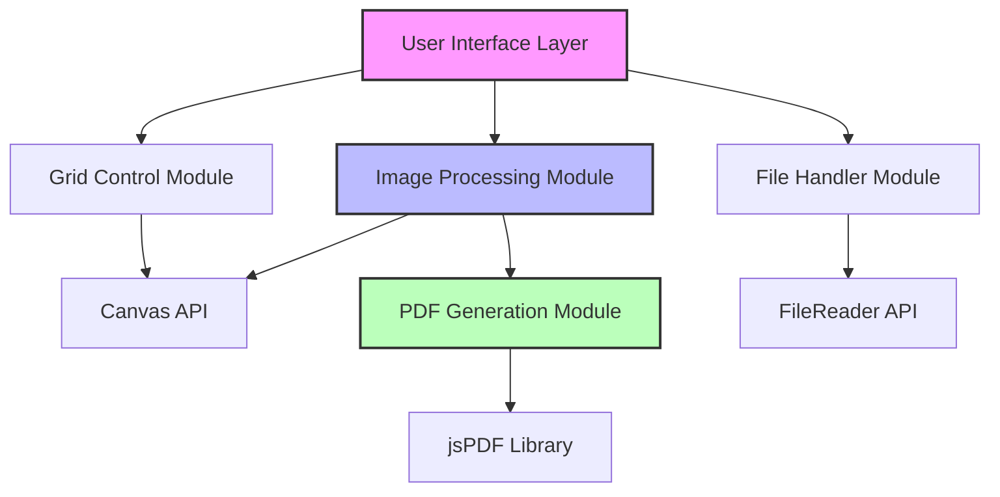
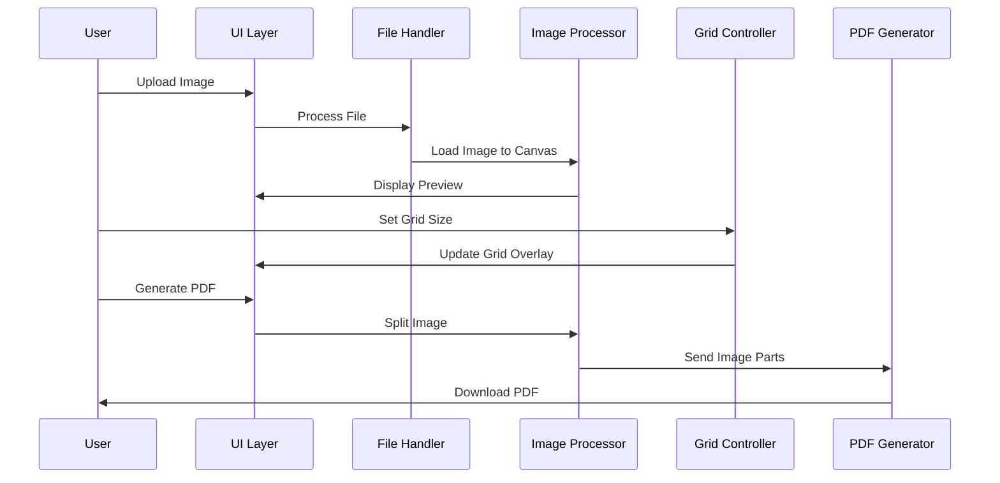

# Image Splitter Application Architecture

## Overview

Single HTML page application that splits images into grid parts and generates PDFs, working entirely in the browser.

## System Architecture

## Component Specifications

### 1. User Interface Layer

- **Upload Area**: Drag-and-drop or click to upload
- **Control Panel**: Grid size inputs (rows/columns)
- **Preview Canvas**: Shows image with grid overlay
- **Action Buttons**: Generate PDF, Reset

### 2. Image Processing Module

- **Max Image Size**: 10MB (configurable)
- **Supported Formats**: JPEG, PNG, WebP, GIF
- **Processing**: Client-side using Canvas API
- **Memory Management**: Image downscaling for preview if needed

### 3. Grid Control Module

- **Default Grid**: 3x3 (suitable for poster printing)
- **Min/Max Grid**: 1x1 to 10x10
- **Visual Feedback**: Real-time grid overlay on image

### 4. PDF Generation Module

- **Page Size**: A4 (210mm × 297mm)
- **Layout**: One grid piece per page
- **Orientation**: Auto-detect (portrait/landscape)
- **Margins**: 10mm on all sides
- **Image Quality**: High (0.92 compression)

## Data Flow

## Technical Defaults

### Image Handling

- **Preview Size**: Max 800x800px (for performance)
- **Memory Limit**: Alert if image > 4000x4000px
- **Compression**: None for processing, maintain quality

### Grid Settings

- **Default**: 3 rows × 3 columns
- **Input Type**: Number inputs with +/- buttons
- **Preview**: Live update on change

### PDF Output

- **Filename**: `image-split-[timestamp].pdf`
- **Page Handling**: Each piece centered on A4
- **Scaling**: Fit to page with aspect ratio preserved

### Error Handling

- **Invalid Files**: "Please upload an image file (JPEG, PNG, WebP, or GIF)"
- **Large Files**: "Image too large. Please use an image under 10MB"
- **Memory Issues**: "Unable to process. Try a smaller image or reduce grid size"
- **Browser Support**: Check for Canvas and FileReader API support

## Browser Compatibility

- Chrome 80+
- Firefox 75+
- Safari 13+
- Edge 80+

## Performance Considerations

- Use Web Workers for large image processing (future enhancement)
- Lazy loading for grid preview updates
- Efficient memory cleanup after processing
